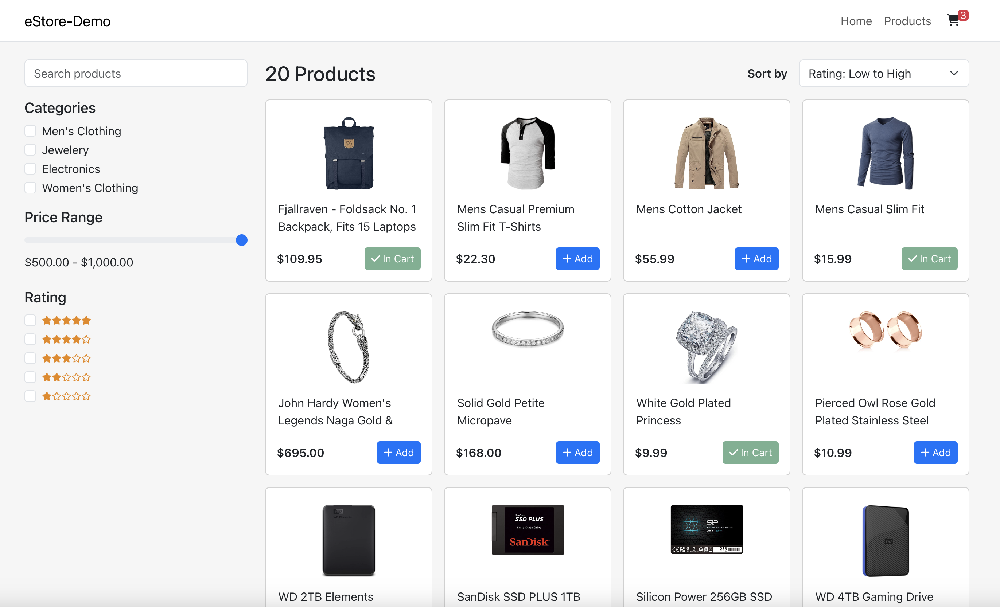
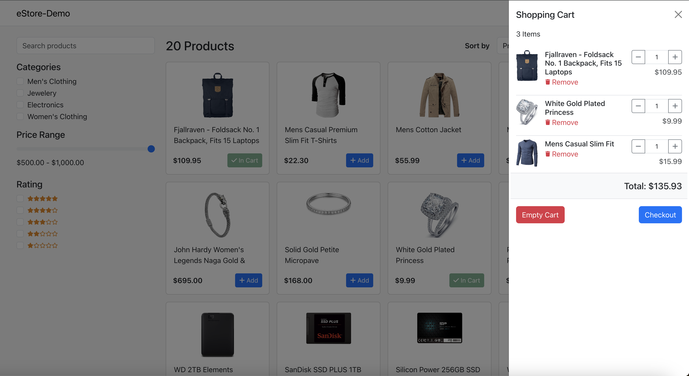
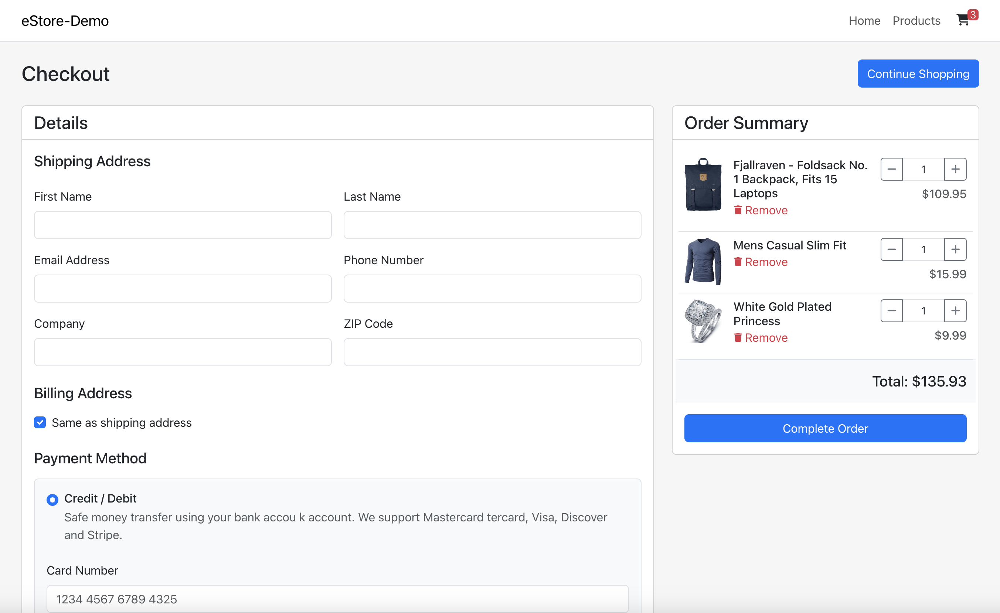
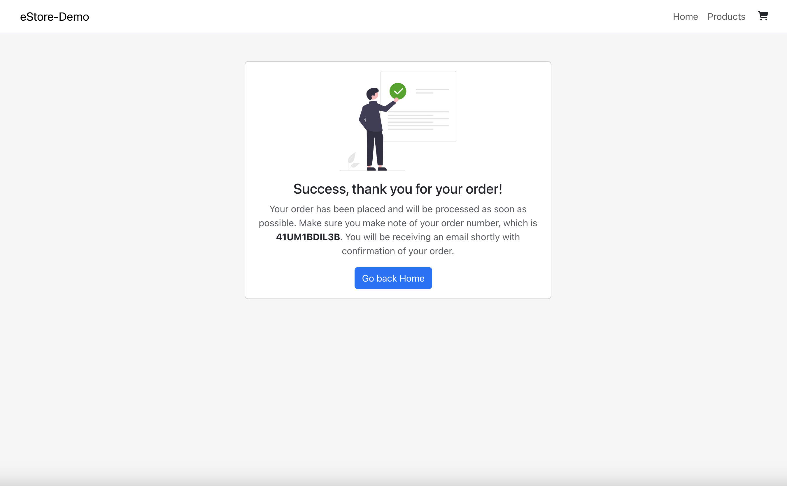

# Ecommerce Prototype

Welcome to the Ecommerce Prototype Application! This project is a React/Redux-based prototype for an ecommerce platform, utilizing React-Bootstrap for UI components.

## Table of Contents

- [Overview](#overview)
- [Features](#features)
- [Installation](#installation)
- [Usage](#usage)
- [Scripts](#scripts)

## Overview

This application is a prototype aimed at showcasing the functionality of an ecommerce platform built with React and Redux. It provides basic features such as product listing, shopping cart management, and checkout process simulation.

## Features

- Product listing with images, descriptions, and prices
- Shopping cart management (add, remove, update quantities)
- Checkout process simulation (address, payment, order confirmation)

| Product Listing Page | Shopping Cart View |
|----------------------|--------------------|
|  |  |

| Checkout Process | Order Confirmation |
|------------------|------------------|
|  |  |

## Installation

To run this application locally, follow these steps:

1. Clone repository:
   ```bash
   git clone https://github.com/decodesalot/react-ecommerce-prototype.git
   ```
2. Navigate into the project directory:
    ```bash
    cd react-ecommerce-prototype
    ```
3. Install Dependencies:
    ```bash
    npm i
    ```
3. Start the development server:
    ```bash
    npm start
    ```

Open [http://localhost:3000](http://localhost:3000) to view it in your browser. 

The page will reload when you make changes.
 

## Usage

Once the application is running locally, you can explore the features and functionalities provided by the ecommerce prototype. You can browse products, add them to your shopping cart, proceed to checkout, and simulate the order placement process.

## Scripts

This project was bootstrapped with [Create React App](https://github.com/facebook/create-react-app). In the project directory, you can run:

### `npm test`

Launches the test runner in the interactive watch mode.\
See the section about [running tests](https://facebook.github.io/create-react-app/docs/running-tests) for more information.

### `npm run build`

Builds the app for production to the `build` folder.\
It correctly bundles React in production mode and optimizes the build for the best performance.

The build is minified and the filenames include the hashes.\
Your app is ready to be deployed!

See the section about [deployment](https://facebook.github.io/create-react-app/docs/deployment) for more information.

### `npm run eject`

**Note: this is a one-way operation. Once you `eject`, you can't go back!**

If you aren't satisfied with the build tool and configuration choices, you can `eject` at any time. This command will remove the single build dependency from your project.

Instead, it will copy all the configuration files and the transitive dependencies (webpack, Babel, ESLint, etc) right into your project so you have full control over them. All of the commands except `eject` will still work, but they will point to the copied scripts so you can tweak them. At this point you're on your own.

You don't have to ever use `eject`. The curated feature set is suitable for small and middle deployments, and you shouldn't feel obligated to use this feature. However we understand that this tool wouldn't be useful if you couldn't customize it when you are ready for it.

## Learn More

You can learn more in the [Create React App documentation](https://facebook.github.io/create-react-app/docs/getting-started).

To learn React, check out the [React documentation](https://reactjs.org/).

### Code Splitting

This section has moved here: [https://facebook.github.io/create-react-app/docs/code-splitting](https://facebook.github.io/create-react-app/docs/code-splitting)

### Analyzing the Bundle Size

This section has moved here: [https://facebook.github.io/create-react-app/docs/analyzing-the-bundle-size](https://facebook.github.io/create-react-app/docs/analyzing-the-bundle-size)

### Making a Progressive Web App

This section has moved here: [https://facebook.github.io/create-react-app/docs/making-a-progressive-web-app](https://facebook.github.io/create-react-app/docs/making-a-progressive-web-app)

### Advanced Configuration

This section has moved here: [https://facebook.github.io/create-react-app/docs/advanced-configuration](https://facebook.github.io/create-react-app/docs/advanced-configuration)

### Deployment

This section has moved here: [https://facebook.github.io/create-react-app/docs/deployment](https://facebook.github.io/create-react-app/docs/deployment)

### `npm run build` fails to minify

This section has moved here: [https://facebook.github.io/create-react-app/docs/troubleshooting#npm-run-build-fails-to-minify](https://facebook.github.io/create-react-app/docs/troubleshooting#npm-run-build-fails-to-minify)
